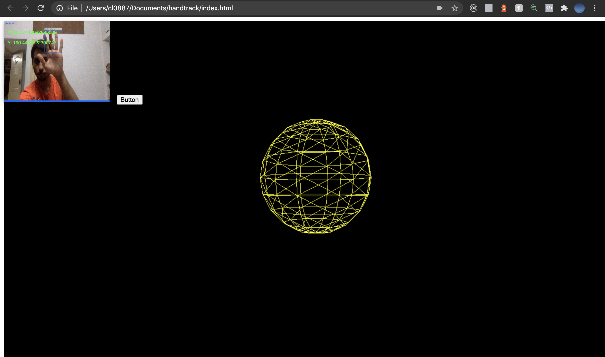
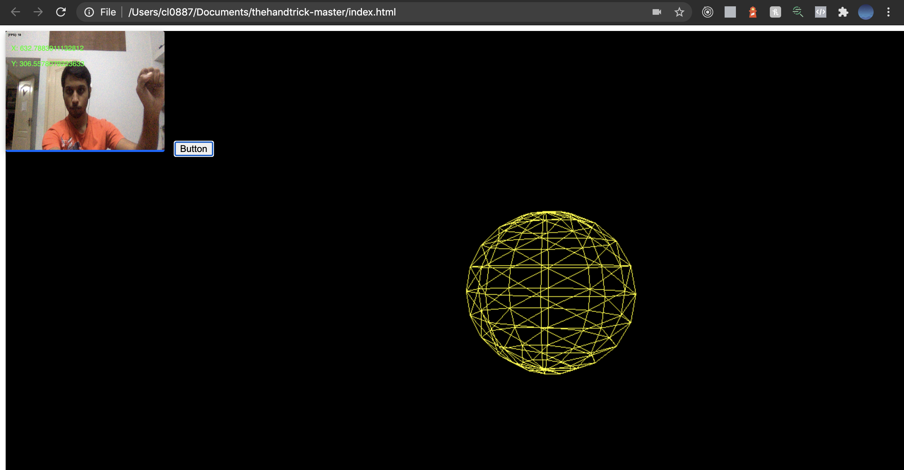

# HandTrack

Move 3d objects rendered using WebGL on the Web browser based on real time hand-detection and tracking. A Convolutional neural network trained using tensorflow object detection api is used for hand tracking. 

### Prerequisites
Before running this locally you must have these installed
- Three.js - for rendering 3d objects on web browser.
- Handtrack.js - real-time hand detection
### Language: Javascript

### Sample screenshots

